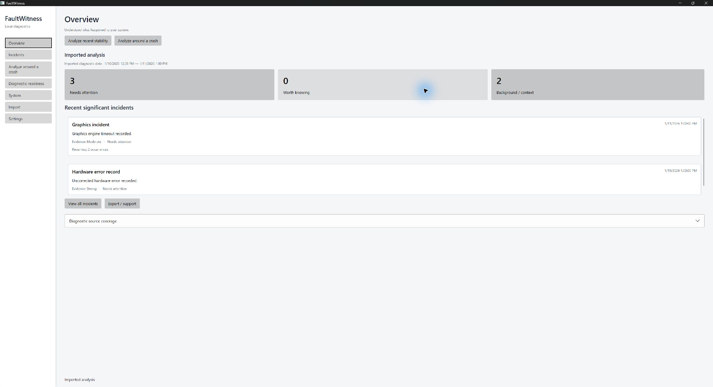
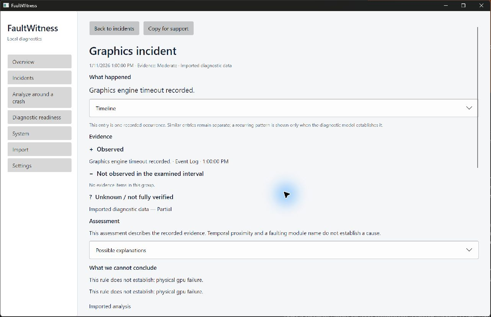
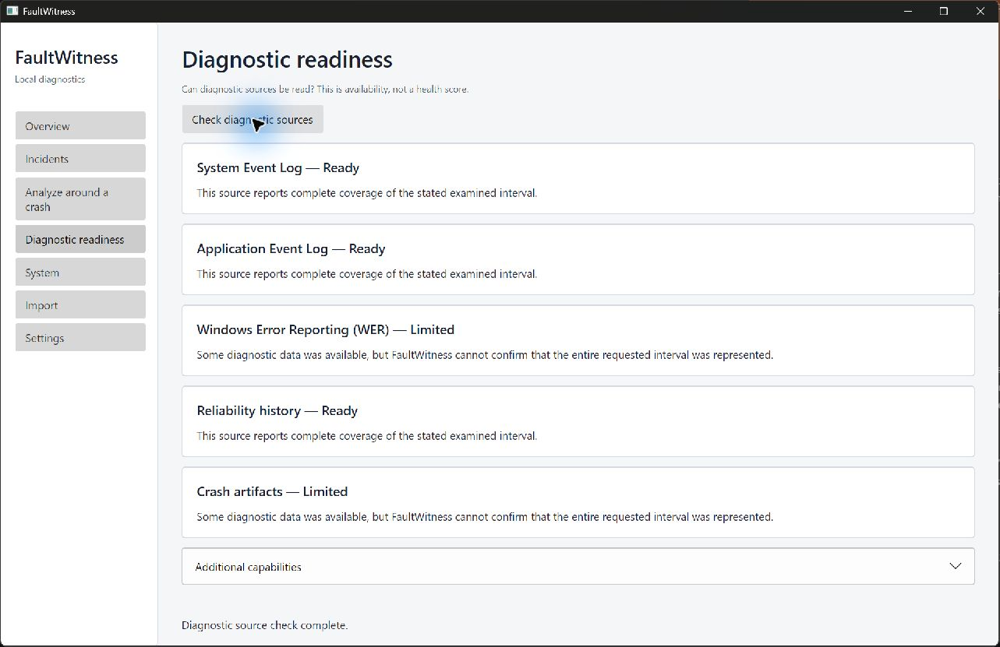
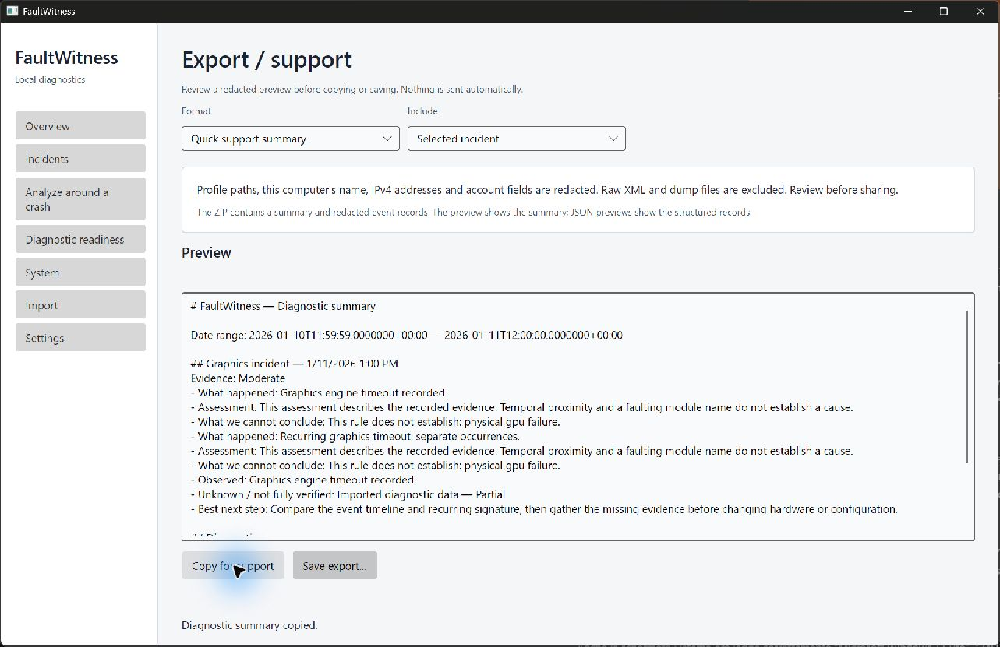

# FaultWitness 0.9.0-beta.1

FaultWitness is a local-first Windows diagnostic evidence organizer. It reads selected local sources, normalizes records, correlates related records into incidents, and reports what the evidence supports. It distinguishes observed facts, correlations, interpretations, hypotheses, and conclusions that cannot be established.

FaultWitness does not diagnose a failing power supply from Kernel-Power 41, a defective CPU from a WHEA event, or a root cause from a faulting module name. This beta has no account, telemetry, analytics, automatic upload, cloud processing, or background service.

## Beta scope

This beta is for **Windows 11 x64 only**. It collects the System and Application Event Logs, Windows Error Reporting archives where accessible, dump artifact metadata, selected system inventory, and supported driver/Windows Update change-history records. The application presents Overview/Incidents, around-time and recent analysis, evidence and coverage detail, Diagnostic Readiness, History, System, local import/export, and runtime language/theme settings.

The optional **Capture Next Crash** workflow configures a future Windows Error Reporting mini-dump for one supported desktop executable basename. It does not capture a running process, analyze dump contents, or prove that a dump will be produced. Configuration requires an administrator-approved UAC operation; Restore and the Action Journal provide explicit recovery and an auditable local record. See [capture security and limitations](docs/capture-next-crash-security.md).

## What changed in this beta

- Added evidence-focused Overview, incident detail, around-time analysis, Diagnostic Readiness, System Inventory, History, and privacy-redacted support exports.
- Added partial driver and Windows Update change correlation without treating timing as causation.
- Added the preview-first Capture Next Crash workflow, exact-state Restore, recovery for interrupted actions, and a persistent local Action Journal.
- Added runtime theme and eight-language support, together with keyboard, layout, localization, and synthetic visual regression coverage.

## Quick start

1. Download the `0.9.0-beta.1` Windows x64 ZIP from the release page.
2. Extract it to a protected folder such as `C:\Program Files\FaultWitness\0.9.0-beta.1` (create the folder with administrator permission). Keep the desktop executable, its supporting files, and the adjacent elevated helper together; do not run the helper directly.
3. Run `FaultWitness.exe` normally. Do not run the main application elevated. Choose **Analyze recent stability** for the default seven-day window, or use **Analyze around a crash** when you know an approximate local time.
4. Review evidence and source coverage. Use **Export / support** to create a privacy-redacted Markdown, HTML, JSON, or ZIP bundle for review. Inspect the redaction preview before sharing.

The first scan is read-only. If you use Capture Next Crash, preview the current state, confirm the target and fixed mini-dump policy, approve the UAC prompt, and verify the result. Restore the configuration when capture is no longer needed. A dump can contain private process memory even when the export is redacted; keep raw dumps local.

Stage each extracted version in a new complete directory; do not overlay files from different versions. Launch the main application unelevated. Administrator rights are needed only to place files in a protected directory or approve a deliberate helper action. Restore any crash-capture configuration before removal if desired. Deleting the program directory does not delete local history, settings, the Action Journal, or captured dumps.

For developers, install the .NET 10 SDK and run:

```powershell
dotnet restore FaultWitness.slnx
dotnet build FaultWitness.slnx --no-restore
dotnet test FaultWitness.slnx --no-build
dotnet run --project src/FaultWitness.App
```

## Privacy and exports

Scan summaries and the Action Journal are stored in SQLite under the local application-data directory. Raw Event XML is not retained in the scan database. Markdown, HTML, JSON, and ZIP support exports redact user-profile paths, the local computer name, and IPv4 addresses by default. Raw XML is opt-in; dumps and dump contents are excluded. FaultWitness does not upload data or automatically send reports anywhere.

## Screenshots

These screenshots are selected from the validated synthetic GUI run (`artifacts/ux-validation/synthetic-gui.zip`) and contain no real dump or diagnostic payload. They are illustrative; labels and layout may change during the beta.









## Known limitations

- Windows 11 x64 is the only supported beta platform. Linux, macOS, ARM64, and 32-bit application capture are outside this release.
- FaultWitness does not analyze dump contents, debug processes, or guarantee that Windows will create a dump. Mini dumps may be insufficient and can still contain private memory.
- Capture Next Crash supports only an ASCII `.exe` basename in the native Windows registry view. Services, hangs, custom crash reporters, automatic-debugger configurations, and WOW64 applications are outside the capture guarantee.
- Diagnostic sources can be unavailable, access-denied, truncated, or absent. Change history is partial and cannot prove an upgrade, removal, or causal relationship; a first observation is not necessarily an installation date.
- Local history retains compact summaries, not raw log XML. Imported data is labelled as imported and does not establish facts about the current machine.
- This is a beta release. Validate findings against the original Windows records and your own incident timeline before making hardware, driver, or recovery decisions.

## License and security

FaultWitness is released under the [MIT License](LICENSE). Redistributed components are listed in [third-party notices](THIRD-PARTY-NOTICES.txt). To report a vulnerability, follow the private-reporting guidance in [SECURITY.md](SECURITY.md); do not post exploit details, raw dumps, or unredacted exports publicly.
