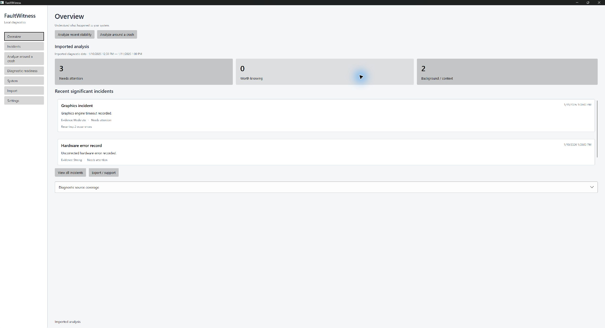
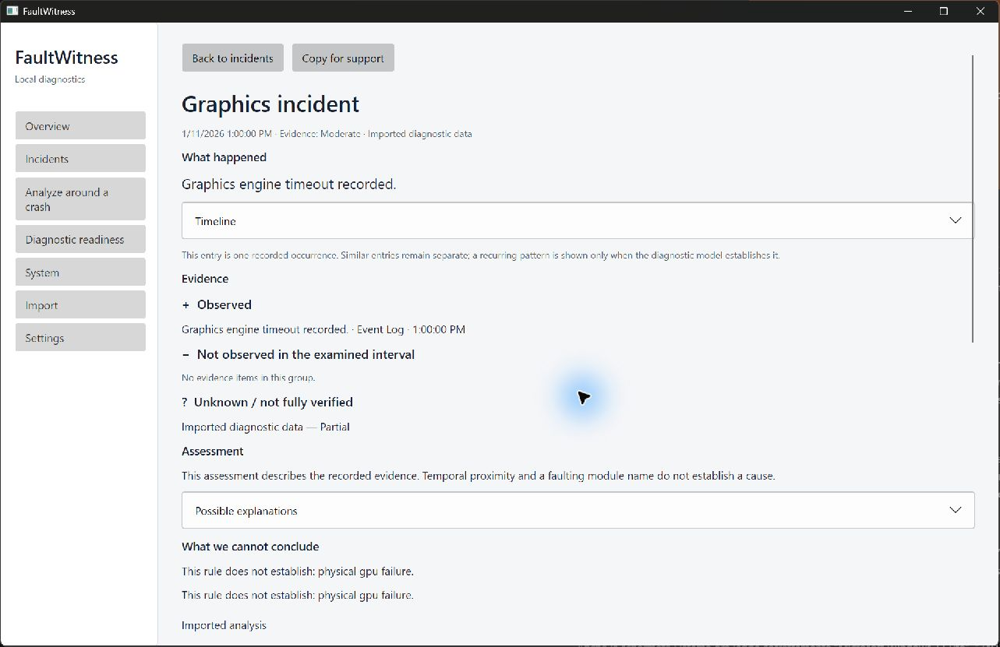
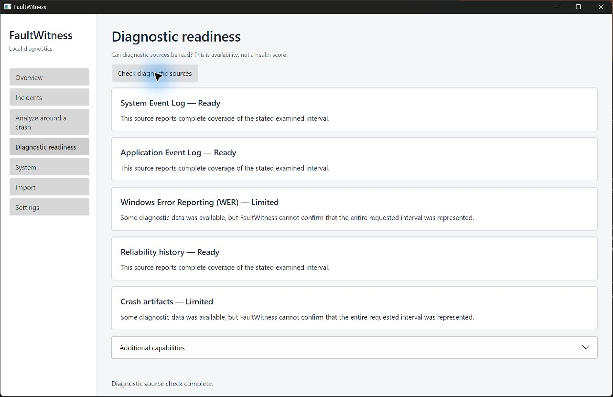
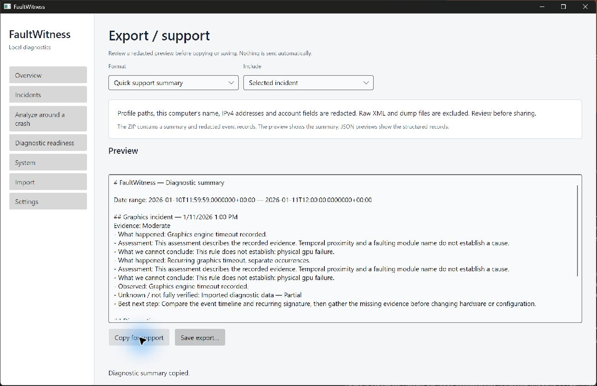

# FaultWitness 0.9.0-beta.1

FaultWitness is a local-first Windows diagnostic evidence organizer. It reads selected local sources, normalizes records, correlates related records into incidents, and reports what the evidence supports. It distinguishes observed facts, correlations, interpretations, hypotheses, and conclusions that cannot be established.

FaultWitness does not diagnose a failing power supply from Kernel-Power 41, a defective CPU from a WHEA event, or a root cause from a faulting module name. This beta has no account, telemetry, analytics, automatic upload, cloud processing, or background service.

## Download and platform support

**Supported:** Windows 11 on Intel or AMD 64-bit x64 PCs.

**Main download:** [FaultWitness-0.9.0-beta.1-win-x64.zip](https://github.com/ToroFede/FaultWitness/releases/download/v0.9.0-beta.1/FaultWitness-0.9.0-beta.1-win-x64.zip)

The matching SHA-256 checksum is published beside it on the [release page](https://github.com/ToroFede/FaultWitness/releases/tag/v0.9.0-beta.1).

**Not supported in this beta:** Windows ARM64 / Snapdragon, Linux, and macOS. No packages for those platforms are provided.

## Unsigned beta

FaultWitness 0.9.0-beta.1 is distributed without a trusted Windows code-signing certificate. Windows may show “Unknown publisher” and/or a Microsoft Defender SmartScreen warning. This does not mean Windows has cryptographically verified the publisher.

The release page provides a SHA-256 checksum so you can verify that the ZIP bytes match the published package. A matching checksum verifies the file contents against that published checksum; it does not verify the publisher's identity. Keep normal Windows security protections enabled.

Trusted code signing is planned for a future release.

## Beta scope

This beta collects the System and Application Event Logs, Windows Error Reporting archives where accessible, dump artifact metadata, selected system inventory, and supported driver/Windows Update change-history records. The application presents Overview/Incidents, around-time and recent analysis, evidence and coverage detail, Diagnostic Readiness, History, System Inventory, local import/export, and runtime language/theme settings.

The optional **Capture Next Crash** workflow configures a future Windows Error Reporting mini-dump for one supported desktop executable basename. It does not capture a running process, analyze dump contents, or prove that a dump will be produced. Configuration requires an administrator-approved UAC operation; Restore and the Action Journal provide explicit recovery and a local record. See [capture security and limitations](docs/capture-next-crash-security.md).

## Highlights

- Evidence-first incident analysis with recent and around-time views, incident detail, and clear evidence coverage.
- Diagnostic Readiness and System Inventory.
- **What Changed** contextual driver and Windows Update evidence; timing does not establish causation.
- History, local import/export, and privacy-redacted support exports.
- Preview-first Capture Next Crash, exact-state Restore, recovery for interrupted actions, and a persistent local Action Journal.
- Local-first operation and eight UI languages.

## Quick start

1. Download the Windows x64 ZIP from the [release page](https://github.com/ToroFede/FaultWitness/releases/tag/v0.9.0-beta.1).
2. Optionally download the adjacent .sha256 file and verify the ZIP with PowerShell:

        (Get-FileHash .\FaultWitness-0.9.0-beta.1-win-x64.zip -Algorithm SHA256).Hash

   Compare the result with the checksum published on the release page.
3. Extract the entire ZIP to a folder you can access, such as a folder under your user profile. Keep all extracted files together, including the helper folder; do not run the helper directly.
4. Open the extracted version folder.
5. Double-click FaultWitness.exe.

Normal use does not require administrator privileges or a separate .NET installation. Do not run the whole application as administrator. Elevation is requested only for explicit protected operations, such as configuring crash capture. The first scan is read-only.

Review evidence and source coverage. Use **Export / support** to create a privacy-redacted Markdown, HTML, JSON, or ZIP bundle for review. Inspect the redaction preview before sharing.

If you use Capture Next Crash, preview the current state, confirm the target and fixed mini-dump policy, approve the UAC prompt, and verify the result. Restore the configuration when capture is no longer needed. A dump can contain private process memory even when an export is redacted; keep raw dumps local.

Stage each extracted version in a new complete directory; do not overlay files from different versions. Deleting the program directory does not delete local history, settings, the Action Journal, or captured dumps.

For developers, install the .NET 10 SDK and run:

    dotnet restore FaultWitness.slnx
    dotnet build FaultWitness.slnx --no-restore
    dotnet test FaultWitness.slnx --no-build
    dotnet run --project src/FaultWitness.App

## Privacy and exports

Scan summaries and the Action Journal are stored in SQLite under the local application-data directory. Raw Event XML is not retained in the scan database. Markdown, HTML, JSON, and ZIP support exports redact user-profile paths, the local computer name, and IPv4 addresses by default. Raw XML is opt-in; dumps and dump contents are excluded. FaultWitness does not upload data or automatically send reports anywhere.

## Screenshots

These screenshots are selected from the validated synthetic GUI run (artifacts/ux-validation/synthetic-gui.zip) and contain no real dump or diagnostic payload. They are illustrative; labels and layout may change during the beta.

## Known limitations

- Windows 11 x64 is the only supported beta platform. Windows ARM64, Linux, and macOS are not supported.
- FaultWitness does not analyze dump contents, debug processes, or guarantee that Windows will create a dump. Mini dumps may be insufficient and can still contain private memory.
- Capture Next Crash supports only an ASCII .exe basename in the native Windows registry view. Services, hangs, custom crash reporters, automatic-debugger configurations, and WOW64 applications are outside the capture guarantee.
- Diagnostic sources can be unavailable, access-denied, truncated, or absent. Change history is partial and cannot prove an upgrade, removal, or causal relationship; a first observation is not necessarily an installation date.
- Local history retains compact summaries, not raw log XML. Imported data is labelled as imported and does not establish facts about the current machine.
- This is a beta release. Validate findings against the original Windows records and your own incident timeline before making hardware, driver, or recovery decisions.

## License and security

FaultWitness is released under the [MIT License](LICENSE). Redistributed components are listed in [third-party notices](THIRD-PARTY-NOTICES.txt). The [Code signing policy](docs/code-signing-policy.md) describes the initial unsigned beta exception and the planned controls for future signed releases. To report a vulnerability, follow the private-reporting guidance in [SECURITY.md](SECURITY.md); do not post exploit details, raw dumps, or unredacted exports publicly.
