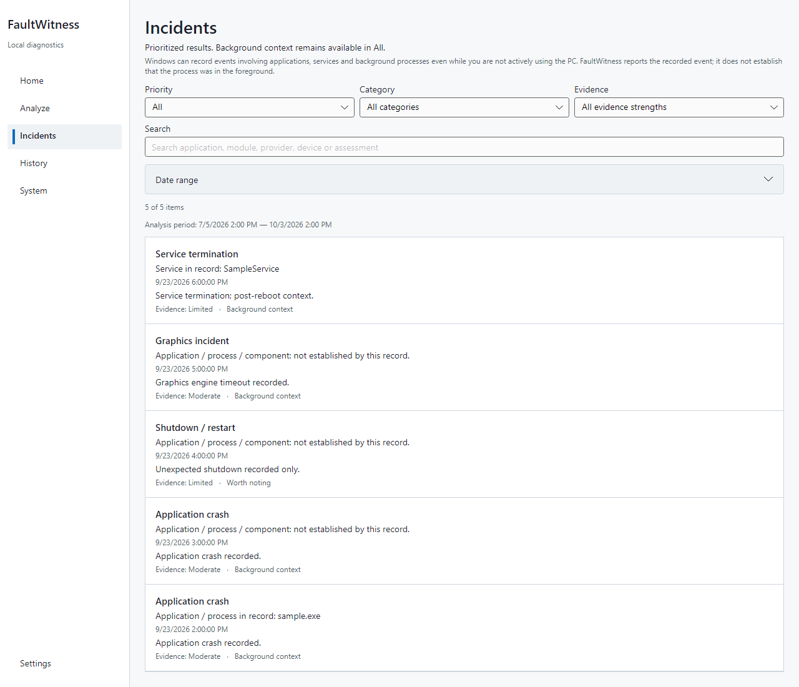
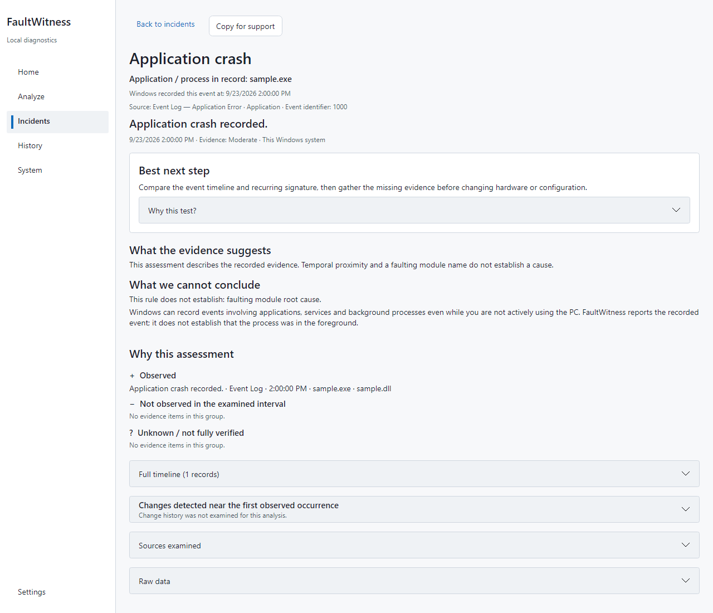

# FaultWitness 0.9.0-beta.2

FaultWitness helps you review Windows evidence after crashes, unexpected restarts, freezes or recurring instability. It examines supported diagnostic records; it is not a general PC health or maintenance checker.

It distinguishes recorded facts, correlations, interpretations, hypotheses and conclusions the evidence cannot establish. Kernel-Power 41 does not prove a failing power supply, a WHEA record does not prove a defective CPU, and a faulting module name does not establish root cause.

## Download

**Supported:** Windows 11 on Intel/AMD 64-bit x64 PCs. This is still a beta. Windows ARM64/Snapdragon, Linux and macOS are not supported.

[Download FaultWitness-0.9.0-beta.2-win-x64.zip](https://github.com/ToroFede/FaultWitness/releases/download/v0.9.0-beta.2/FaultWitness-0.9.0-beta.2-win-x64.zip). The matching **SHA256.txt** is on the [pre-release page](https://github.com/ToroFede/FaultWitness/releases/tag/v0.9.0-beta.2).

This beta is unsigned. Windows may display Unknown publisher or a SmartScreen warning. A matching SHA-256 verifies package bytes against the published checksum; it does not authenticate the publisher. Keep normal Windows security protections enabled. Trusted signing is planned for a future release.

## Quick start

1. Extract the entire ZIP into a new folder. Keep `app/` and all its contents beside the root launcher; do not mix versions or run the helper directly.
2. Open the version folder and double-click **FaultWitness.exe**. No separate .NET installation or administrator privileges are required for normal use.
3. Open **Analyze → Analyze**. Select 24 hours, 7 days, 30 days, a custom period of **at most 90 days**, or investigate around a known time. The first analysis is read-only.
4. Review **Incidents** and open a detail. The recorded type, application/process/component where known, timestamp, source and causal limits help explain what Windows recorded.
5. Use **System → Inventory** for collected system information or **System → Diagnostic Readiness** to inspect source availability and access. Readiness is optional investigation, not a prerequisite health scan.

The clean-root package contains `FaultWitness.exe`, `README.md`, `QUICKSTART.md` and `app/`. The root launcher starts only the fixed `app/FaultWitness.exe`, without elevation. Keep `app/helper/` intact for optional administrator-approved capture operations.

Windows can record events from applications, services and background processes while you are not actively using the PC. FaultWitness reports the record and does not assume foreground use. Missing process identity is stated explicitly.

A completed quiet analysis shows its analyzed period and whether source coverage was limited. No supported relevant incident in the examined records does **not** prove that no instability occurred. Background context stays distinct from incidents needing attention or worth noting.

## Scope and optional capture

Supported sources include System/Application Event Logs, accessible Windows Error Reporting archives, dump artifact metadata, selected inventory and supported driver/Windows Update change history. History, local import/export and runtime language/theme settings are available. Temporal proximity does not establish causation; imported records do not establish facts about the current PC.

**Analyze → Capture next crash** previews and optionally configures a future Windows Error Reporting mini-dump for one supported desktop executable basename. It does not capture a running process, analyze dump contents or guarantee a dump. Explicit protected operations request UAC approval. Restore and the local Action Journal support recovery. See [capture security and limitations](docs/capture-next-crash-security.md).

Capture supports ASCII `.exe` basenames in the native Windows registry view. Services, hangs, custom crash reporters, automatic debuggers and WOW64 applications are outside the capture guarantee. Mini-dumps may be insufficient and can contain private process memory; keep raw dumps local.

## Privacy and export

No account, telemetry, analytics, automatic upload, cloud processing or background service. Scan summaries, settings and the Action Journal stay under local application data. Raw Event XML is not retained in the scan database.

**Export / support** offers privacy-redacted Markdown, HTML, JSON and ZIP bundles. Profile paths, the computer name and IPv4 addresses are redacted by default; raw XML is opt-in and dumps are excluded. Inspect the preview before sharing. Deleting the program folder does not delete history, settings, journals or captured dumps.

## Screenshots

These current beta.2 views use clearly illustrative sample records evaluated by the production rules. They contain no real diagnostic payload and do not demonstrate native privileged Capture success.

See [beta.2 release notes](docs/release-notes-0.9.0-beta.2.md) for the changes since beta.1. Diagnostic sources can be unavailable, access-denied, truncated or absent. Validate findings against the original Windows records and your timeline before changing hardware or configuration.

## Development and license

With the .NET 10 SDK: `dotnet restore FaultWitness.slnx`, `dotnet build FaultWitness.slnx`, `dotnet test FaultWitness.slnx`, then `dotnet run --project src/FaultWitness.App`. Official Windows packages also build the native root launcher using Visual Studio C++ Build Tools.

[MIT License](LICENSE) · [third-party notices](THIRD-PARTY-NOTICES.txt) · [code signing policy](docs/code-signing-policy.md) · [private security reporting](SECURITY.md). Do not post raw dumps, exploits or unredacted exports publicly.
