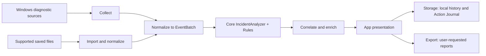
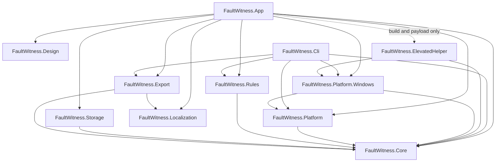
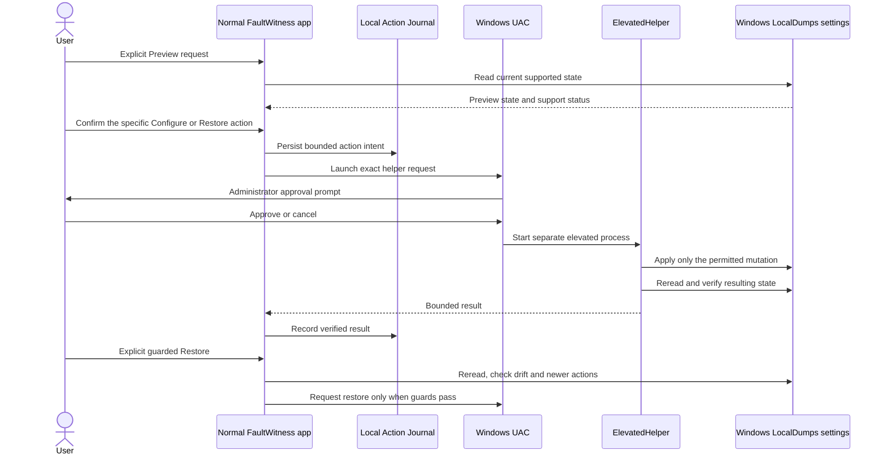

# FaultWitness architecture

Start at [src/README.md](../src/README.md) for a short project directory guide. This page describes the current repository structure and the direction of its direct project references.

## Product flow

For a local recent or around-time analysis, `DesktopServices` reads Windows sources, creates normalized records, runs `IncidentAnalyzer` with the rule catalog, and enriches the result with retained occurrences and Windows change history. Supported imports enter through `WindowsImportService`; their records and partial source coverage go through the same analyzer and result presentation. The App stores summaries locally and exports only when requested. Persistence and export are separate consumers of the presented result.

## Production project references

Arrows point from a project to a direct `ProjectReference` dependency in its current `.csproj`. The test projects are omitted. The App-to-Helper edge builds and stages the helper payload with `ReferenceOutputAssembly=false`; it is not a runtime assembly reference. The graph is acyclic.

## Project responsibilities and boundaries

| Project | Responsibility and reason for the boundary |
|---|---|
| `FaultWitness.App` | Avalonia desktop shell, pages, view model, presentation adapters, settings, and Windows desktop composition. The GUI normally runs as the signed-in user. The shell and Incident Detail are authored in AXAML with semantic UserControls, shared AXAML styles, and a bindable presentation projection. Other pages remain programmatic C# pending Pass 2B. |
| `FaultWitness.Core` | Platform-neutral event, incident, evidence, coverage, inventory, and capture-policy semantics; analysis, correlation, and neutral capture contracts. Keeping Windows APIs and UI out of Core lets diagnostic meaning be reviewed and tested without an operating-system collector. |
| `FaultWitness.Platform` | Neutral collection contracts and change-history enrichment orchestration. It keeps acquisition seams and enrichment outside Core's diagnostic semantics. |
| `FaultWitness.Platform.Windows` | Windows Event Log, WER, Reliability, dump-artifact, import, readiness, inventory, change-history, registry, and helper-client behavior. Windows APIs and OS-specific normalization stay at this boundary. |
| `FaultWitness.Rules` | Provider-aware diagnostic policy, rule definitions, and diagnostic facts. Keeping rules separate makes supported evidence thresholds and false-positive controls visible without moving policy into the neutral engine or UI. |
| `FaultWitness.Storage` | SQLite-backed analysis history and capture Action Journal. SQLite schema and persistence policy stay outside Core. |
| `FaultWitness.Export` | Shared report and system-summary export used by App and CLI, with localized presentation. It does not depend on Avalonia or Storage. |
| `FaultWitness.Localization` | Eight shared resource sets and `LocalizationService`, referenced by App and Export so translated product wording has one owner. |
| `FaultWitness.Design` | Reads and validates the canonical design tokens embedded from `docs/design/faultwitness.tokens.json`; the App consumes its resolved design resources. |
| `FaultWitness.Cli` | Separate Windows command-line entry point for scan, around-time, import, export, and version operations. It shares Core, platform collection, Rules, and Export without hosting the GUI. |
| `FaultWitness.ElevatedHelper` | Separate one-shot administrator process with a bounded request protocol. It is staged beside the normal App and performs only the permitted capture-configuration mutation. Process separation keeps routine diagnostics and the GUI unelevated. |

These are repository boundaries, not separately released SDKs. The current desktop composition is Windows-specific: Core is neutral and Windows collection is isolated, but App targets and composes Windows services. Linux or macOS support would need real collectors, rules, and platform composition for those systems; a build switch alone would not provide it.

## Privileged capture flow

The journal stores intent before dispatch and the verified result afterward so an interrupted operation remains distinguishable from success. Restore checks the current state and newer unreverted actions before requesting the previous supported state. The App itself does not normally run elevated, and the helper protocol does not accept arbitrary registry paths or commands.

## Where do I change X?

| Change | Current files |
|---|---|
| Home/Analyze copy | `src/FaultWitness.App/MainWindow.Analysis.cs`; `src/FaultWitness.Localization/Strings*.resx` |
| Incident Detail UI | `src/FaultWitness.App/Views/Pages/IncidentDetailView.axaml`; `src/FaultWitness.App/Presentation/IncidentDetailPresentation.cs`; `src/FaultWitness.App/EvidencePresentation.cs` |
| Diagnostic rule | `src/FaultWitness.Rules/RuleCatalog.cs`; `src/FaultWitness.Rules/ProviderAwareRule.cs`; `src/FaultWitness.Rules/DiagnosticFacts.cs` |
| Negative evidence / coverage | `src/FaultWitness.Core/CoveragePolicy.cs`; `src/FaultWitness.Core/Analysis.cs`; presentation in `src/FaultWitness.App/EvidencePresentation.cs` |
| Windows normalization/import | `src/FaultWitness.Platform.Windows/WindowsDiagnosticsProvider.cs`; `src/FaultWitness.Platform.Windows/WindowsImportService.cs`; `src/FaultWitness.Platform.Windows/WerParser.cs` |
| What Changed | `src/FaultWitness.Platform.Windows/WindowsChangeHistoryProvider.cs`; `src/FaultWitness.Platform/ChangeHistoryEnricher.cs`; `src/FaultWitness.Core/ChangeCorrelator.cs`; display in `src/FaultWitness.App/Presentation/IncidentDetailPresentation.cs` and `Views/Pages/IncidentDetailView.axaml` |
| Readiness / Inventory | `src/FaultWitness.Platform.Windows/WindowsDiagnosticReadiness.cs`; `src/FaultWitness.Platform.Windows/WindowsReadinessSources.cs`; `src/FaultWitness.Platform.Windows/WindowsSystemInventory.cs`; UI in `src/FaultWitness.App/MainWindow.Pages.cs` |
| Capture / Restore | `src/FaultWitness.App/CaptureWorkflow.cs`; `src/FaultWitness.App/MainWindow.Capture.cs`; `src/FaultWitness.Platform.Windows/CrashCaptureRegistry.cs`; `src/FaultWitness.ElevatedHelper/Program.cs` and `CaptureRequestProtocol.cs` |
| Storage / History / Journal | `src/FaultWitness.Storage/FaultWitnessStore.cs`; `src/FaultWitness.Storage/CaptureJournalStore.cs`; history UI in `src/FaultWitness.App/MainWindow.Pages.cs` |
| Export / privacy | `src/FaultWitness.App/MainWindow.Export.cs`; `src/FaultWitness.Export/ReportExporter.cs`; `src/FaultWitness.Core/SystemChangePrivacy.cs` |
| Theme / design tokens | `docs/design/faultwitness.tokens.json`; `src/FaultWitness.Design/DesignTokenCatalog.cs`; App resource bridge in `src/FaultWitness.App/Application.cs`; `Styles/SharedStyles.axaml`; responsive shell coordination in `Views/MainWindow.axaml.cs` |
| Release ZIP layout | `scripts/Compose-ReleaseArtifact.ps1`; validation in `scripts/Test-ReleaseArtifact.ps1` |

## AXAML ownership and incremental migration

`Views/MainWindow.axaml` owns the navigation shell, page host and status area. Its code-behind coordinates the existing `MainViewModel`, runtime language/theme changes, window lifecycle and the remaining C# page builders. `Views/Pages/IncidentDetailView.axaml` owns the complete Incident Detail layout; its code-behind only forwards Back, support preview and occurrence requests. There is one production detail implementation, with no legacy layout fallback.

`Views/Components/` contains IncidentHeader, RecommendedActionCard, AssessmentSummary, EvidenceSummary, CoverageSummary and EventRecordDetails. These represent semantic regions or repeated technical-record behavior, rather than generic control wrappers. `Styles/SharedStyles.axaml` consumes the existing token catalog through scalar and typed resources bridged in `Application.cs`. Use AXAML for static structure, bindings, templates and shared styles; keep navigation, services and presentation projections in C#. Everything remains inside the App assembly.

`Presentation/IncidentDetailPresentation.cs` projects an existing Incident/ScanResult. It never evaluates rules or independently scores evidence/actions. The first existing distinct supported action remains the best next step; every evidence item, including duplicates, negative and unknown items, is retained. Interpretations and distinct causal limitations stay visible above investigation disclosures. Source coverage remains the original five-state contract. Changes and recurrence use the existing domain data and presentation helpers.

The selected detail view is retained during theme changes, responsive resizing, language changes and navigation away/back to the same incident. Outer disclosures retain state; translated item templates are refreshed on language changes. Switching to another incident creates a new detail view. This is local view lifetime, not persisted session state.

`IncidentDetailDesignData.Sample` supplies fixed, synthetic, in-memory design data to the page preview. The shell selects memory-only services in Avalonia design mode; preview must never collect Windows events, write history or configure capture. An Avalonia-compatible IDE AXAML preview extension is required for interactive designer preview ([official IDE setup](https://docs.avaloniaui.net/docs/get-started/set-up-your-ide)); the repository's headless render tests validate the runtime AXAML independently.

Home, Analyze, Incidents, History, System, Diagnostic Readiness, Capture, Settings and Export/Support content remain in the existing MainWindow partial builders. Pass 2B should adopt these ownership patterns incrementally without changing diagnostic or privileged service semantics.
